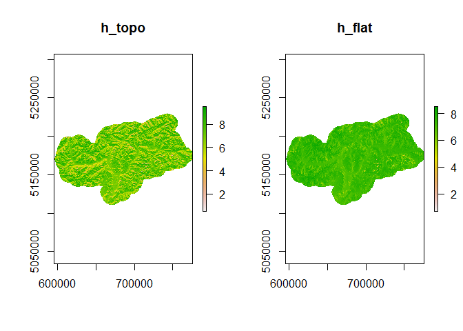
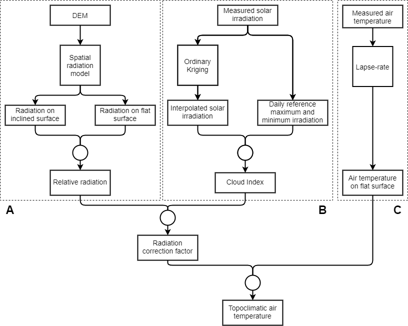
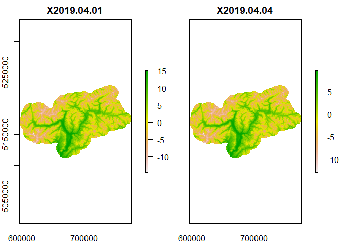
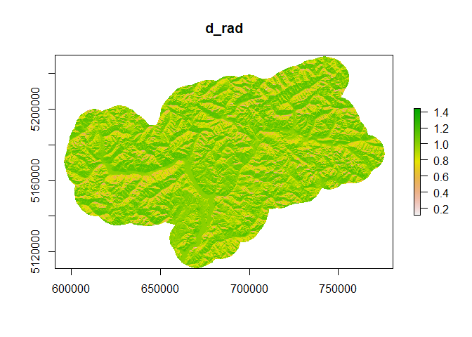
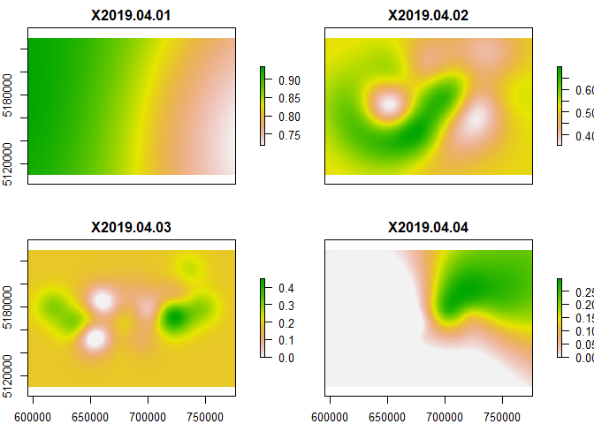
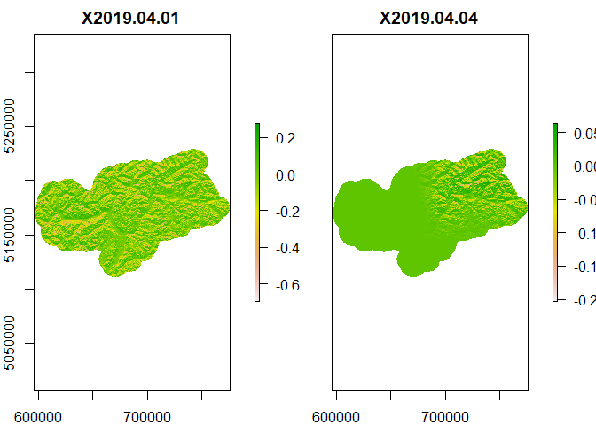
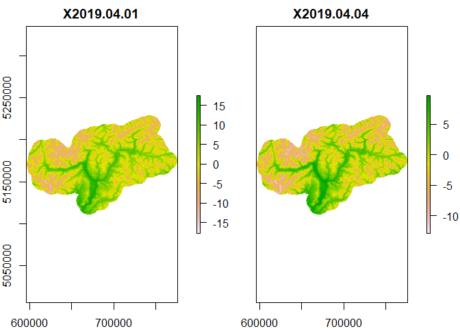

-   [topoclim](#topoclim)
    -   [Overview](#overview)
    -   [Installation](#installation)
    -   [Included Datasets](#included-datasets)
    -   [Model Examples](#model-examples)
        -   [Lapse-rate model](#lapse-rate-model)
        -   [Relative Radiation Factor](#relative-radiation-factor)
        -   [Cloud Index](#cloud-index)
        -   [Radiation correction factor](#radiation-correction-factor)
        -   [Cloud-correted temperature](#cloud-correted-temperature)

<!-- README.md is generated from README.Rmd. Please edit that file -->

# topoclim

[](https://zenodo.org/badge/latestdoi/330615224)

## Overview

This document describes the R-package **topoclim**, which was originally
published in the article *Tscholl et al. (2021), Coupling solar
radiation and cloud cover data for enhanced temperature predictions over
topographically complex mountain terrain. International Journal of
Climatology, under review*. The package presents an innovative method to
estimate air temperature at high spatiotemporal resolution over complex
mountain terrain, called the cloud-corrected model. The cloud-corrected
model uses a correction factor to include the effects of slope, aspect,
cloud cover and solar position on local air temperature estimates. The
following document illustrates the principles of the approach by
applying it to South Tyrol, a mountainous study area in the inner alps,
during April 2019.

## Installation

You can install the package using:

``` r
devtools::install_github('sitscholl/topoclim')
```

The following script also uses the `raster`, `gstat` and `automap`
packages, which can be installed using the code below.

``` r
install.packages(c('raster', 'gstat', 'automap'))
```

``` r
library(topoclim)
library(raster)
```

## Included Datasets

The topoclim package includes the following datasets:

-   **official\_stations:** A SpatialPointsDataFrame with the location
    of the official stations
-   **timeseries:** A table with daily measurements of mean temperature
    and solar insolation from the official stations for the period 2017
    until 2019
-   **rad\_longterm:** A table with daily measurements of solar
    insolation for seven stations for several years (up to 32 years)
-   **h\_topo:** A RasterStack with incoming solar insolation in kWh/m²
    for the study area for each month with a resolution of 100m
-   **h\_flat:** A RasterStack with incoming solar insolation in kWh/m²
    for the study area using constant values of 0 for slope and aspect
    (e.g. on a flat surface) for each month with a resolution of 100m
-   **dem:** A digital elevation model of the study area with a
    resolution of 100m

Use the syntax `?DatasetName` (e.g. `?official_stations`) to get more
information about a certain dataset. The following code imports some of
these datasets, that are required to run the cloud-corrected model.

``` r
data("official_stations")
data("timeseries")
data("rad_longterm")
h_topo <- stack( system.file('extdata', 'h_topo.tif', package = 'topoclim') )
h_flat <- stack( system.file('extdata', 'h_flat.tif', package = 'topoclim') )
dem <- raster( system.file('extdata', 'dem.tif', package = 'topoclim') )
```

**h\_topo** and **h\_flat** were both calculated using the [Solar
Analyst in
ArcGIS](https://desktop.arcgis.com/en/arcmap/10.3/tools/spatial-analyst-toolbox/area-solar-radiation.htm#),
version 10.6.1. Two separate files were calculated for a single
reference day for each month. For **h\_topo** we set the option
`slope_aspect_input_type` to `FROM_DEM` and for **h\_flat** to
`FLAT_SURFACE`. For model parameters and reference days, please check
the associated article. For the present demonstration, we will only
consider the month of April in 2019, but other timeperiods can also be
calculated by adjusting the parameters in the following script.

``` r
test_month <- 4

h_topo <- h_topo[[test_month]]
h_flat <- h_flat[[test_month]]
```

<div class="figure">


<p class="caption">
Incoming solar insolation during April with and without consideration of
aspect and slope.
</p>

</div>

## Model Examples

The following sections will illustrate the cloud-corrected model
step-by-step. First, the calculation of the **lapse-rate model** is
described, followed by the **relative radiation factor**, the **cloud
index**, the **radiation correction factor** and, finally, the
**cloud-corrected temperature**.



### Lapse-rate model

The lapse-rate model is a simple linear regression with elevation as
explanatory and air temperature as dependent variable. Because it does
not consider slope or aspect of a surface, the predictions from the
lapse-rate model describe the air temperature of a flat surface across
different elevation levels.

``` r
#subset timeseries of measurements to period of interest
dateseq <- seq.Date(as.Date('2019-01-01'), 
                    as.Date('2019-12-31'), 
                    by = 'day')
dateseq_i <- which(as.numeric(format(dateseq, '%m')) == test_month)
dateseq_sub <- dateseq[dateseq_i]

timeseries_sub <- subset(timeseries, date %in% dateseq_sub)
timeseries_split <- split(timeseries_sub, timeseries_sub$date)

#join elevation column
lr_split <- lapply(timeseries_split, merge, official_stations@data, by = 'st_id')
#train linear models
lr_fit <- lapply(lr_split, lm, formula = tmean ~ elev)

names(dem) <- 'elev'

#predict
t_flat <- lapply(lr_fit, predict, object = dem)
t_flat <- stack(t_flat)
```

<div class="figure">


<p class="caption">
Predictions from the lapse-rate model for two example days during April
2019.
</p>

</div>

### Relative Radiation Factor

The relative radiation factor is defined as the ratio between incoming
solar insolation on an inclined and flat surface:

d\_rad = h\_topo / h\_flat

We can therefore calculate `d_rad` by dividing the raster objects
`h_topo` and `h_flat`. Because `h_flat` contains some unrealistic jumps
in pixel values on ridges and mountain tops, it is first smoothed using
a 5x5 pixel filter.

``` r
h_flat2 <- focal(h_flat, w = matrix(1, 5, 5), fun = mean)
d_rad <- h_topo / h_flat2
```

<div class="figure">


<p class="caption">
Relative radiation during April.
</p>

</div>

### Cloud Index

The cloud index `c` can be calculated using the following formula:

c = ( h\_obs - h\_cloud ) / ( h\_clear - h\_cloud )

The first step is to calculate monthly reference values for maximum and
minimum solar insolation. The maximum reference solar insolation is
defined as the mean of all insolation measurements above the 95%
quantile and the minimum reference insolation as the mean of all
insolation measurements below the 95% quantile. Outliers were already
removed from this dataset using a 3-sigma test.

``` r
h_clear_monthly <- aggregate(list(h_clear = rad_longterm$insolation),
                             by = rad_longterm[c('st_id', 'month')],
                             FUN = function(x){
                               mean(x[x >= quantile(x, .95, na.rm = T)], na.rm = T)
                             })

h_cloud_monthly <- aggregate(list(h_cloud = rad_longterm$insolation),
                             by = rad_longterm[c('st_id', 'month')],
                             FUN = function(x){
                               mean(x[x <= quantile(x, .05, na.rm = T)], na.rm = T)
                             })
h_ref_month <- merge(h_clear_monthly, h_cloud_monthly, by = c('st_id', 'month'))
```

From the monthly reference values, the daily reference values `h_clear`
and `h_cloud` are estimated via linear interpolation for every station.
This can be accomplished using the function `complete_ts()`, which is
included in this package. Internally, the function uses the function
`na_interpolation()` from the package `imputeTS`.

``` r
h_ref_split <- split(h_ref_month, h_ref_month$st_id)

h_ref <- lapply(h_ref_split, complete_ts)
h_ref <- do.call(rbind, h_ref)
```

Because there are only small differences for `h_clear` and `h_cloud`
between the single stations, the average values across all stations is
used to calculate the cloud index:

``` r
h_ref <- aggregate(h_ref[c('h_clear', 'h_cloud')],
                   by = h_ref[c('day', 'month')],
                   FUN = mean)
```

`h_obs` is calculated by using ordinary kriging together with the
observed insolation from all the official stations. The packages `gstat`
and `automap` are used to perform the kriging. This step can take some
time to calculate (ca. 30s per day)

``` r
krige_split <- lapply(timeseries_split, merge, x = official_stations, by = 'st_id', all.y = T)
```

``` r
h_var <- lapply(krige_split, function(x) {
  
  var <- automap::autofitVariogram(formula = insolation ~ 1,
                                   input_data = x)
  return(var$var_model)
  
})

h_fit <- mapply(gstat::gstat, data = krige_split, model = h_var,
                MoreArgs = list(g = NULL, id = 'insol', formula = insolation ~ 1),
                SIMPLIFY = F)

h_obs <- lapply(h_fit, raster::interpolate, object = dem)
h_obs <- stack(h_obs)

#kriging can produce negative radiation values for some pixels
h_obs[h_obs < 0] <- 0

names(h_obs) <- names(krige_split)
```

In the last step, the cloud index is computed. In the present example,
we only consider the month of April. There can be some pixels, where the
interpolated value `h_obs` is higher or lower than our reference values
`h_clear` and `h_cloud`, respectively. This would lead to cloud index
values above one or below zero. To avoid this, values above one are
assigned a value of one, and values below zero a value of zero.

``` r
h_ref_sub <- subset(h_ref, month == test_month)

c <- (h_obs - h_ref_sub$h_cloud) / (h_ref_sub$h_clear - h_ref_sub$h_cloud)

##Limit to range 0-1
c[c < 0] <- 0
c[c > 1] <- 1

names(c) <- names(krige_split)
```

<div class="figure">


<p class="caption">
The cloud index for two example days during April 2019.
</p>

</div>

### Radiation correction factor

The relative radiation factor and cloud index are both combined to the
radiation correction factor:

D\_rad = c \* d\_rad - c

``` r
D_rad <- c * d_rad - c

names(D_rad) <- names(krige_split)
```

<div class="figure">


<p class="caption">
The radiation correction factor for two example days during April 2019.
</p>

</div>

### Cloud-correted temperature

Cloud-corrected air temperature is calculated by combining the
predictions from the lapse-rate model with the radiation correction
factor, using the following formula:

t\_topo = t\_flat + ( D\_rad \* m\_rad \* \|t\_flat\| )

`m_rad` is an empirical relationship between air temperature and
incoming solar radiation and describes the change in local air
temperature by an increase/decrease of incoming solar radiation. `m_rad`
is defined as the slope of the linear regression between observed air
temperature and solar insolation from the official stations with a long
timeseries.

``` r
rad_mean <- aggregate(list(rad_mean = rad_longterm$insolation),
                      by = rad_longterm['st_id'],
                      FUN = mean, na.rm = T)
tair_mean <- aggregate(list(tmean_mean = rad_longterm$tmean),
                       by = rad_longterm['st_id'],
                       FUN = mean, na.rm = T)

perc_diff <- merge(rad_longterm, rad_mean, by = 'st_id', all.x = T)
perc_diff <- merge(perc_diff, tair_mean, by = 'st_id', all.x = T)
perc_diff$tmean_diff <- (perc_diff$tmean - perc_diff$tmean_mean) / perc_diff$tmean_mean
perc_diff$rad_diff <- (perc_diff$insolation - perc_diff$rad_mean) / perc_diff$rad_mean

fit <- lm(tmean_diff ~ rad_diff, data = perc_diff)
m_rad <- fit$coefficients['rad_diff']

round(m_rad, 2)
#> rad_diff 
#>     0.93
```

`m_rad` amounts to 0.93, which means that a change of radiation by 1%
changes local air temperature by 0.93%. Given this value, we can then
calculate the final cloud-corrected air temperature.

``` r
t_topo <- t_flat + (D_rad * m_rad * abs(t_flat))

names(t_topo) <- names(krige_split)
```

<div class="figure">


<p class="caption">
Cloud-corrected air temperature for two example days during April 2019.
</p>

</div>
