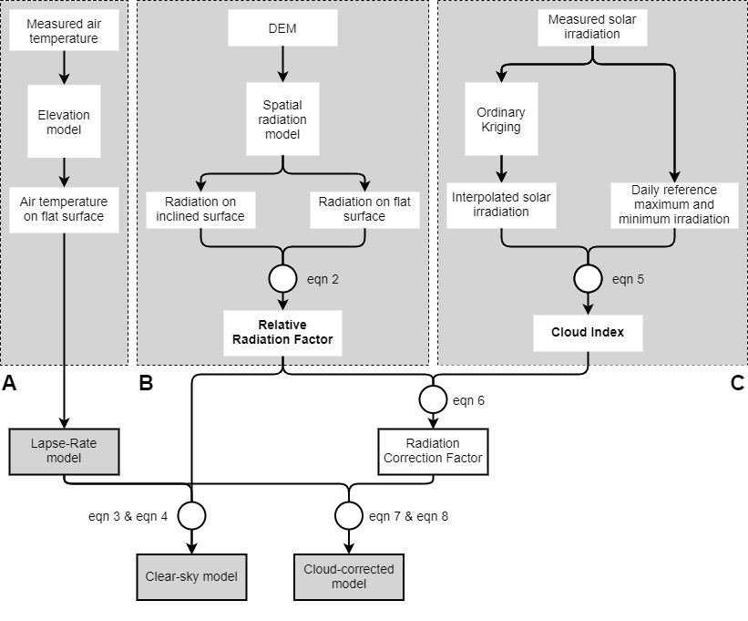
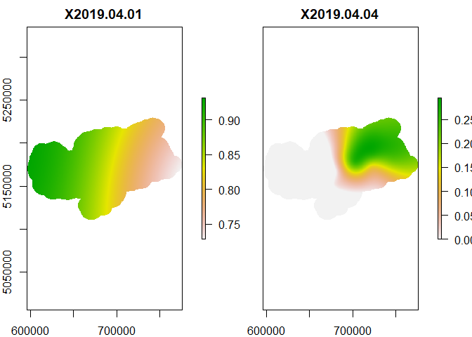

-   [topoclim](#topoclim)
    -   [Overview](#overview)
    -   [Installation](#installation)
    -   [Included Datasets](#included-datasets)
    -   [Calculating topoclimatic air
        temperature](#calculating-topoclimatic-air-temperature)
        -   [Relative Radiation](#relative-radiation)
        -   [Cloud Index](#cloud-index)
        -   [Radiation correction factor](#radiation-correction-factor)
        -   [Lapse-rate model](#lapse-rate-model)
        -   [Topoclima](#topoclima)

<!-- README.md is generated from README.Rmd. Please edit that file -->

# topoclim

## Overview

The goal of the package **topoclim** is to provide supplementary code
and explanations for the article **XXX**. We included the code that was
used to calculate the results presented in the article, together with
datasets that allow everyone to run the present code. This document
describes the calculation of daily topoclimatic air temperature at the
example of April 2019 for the study area South Tyrol. Additionally, we
also provide the results from our validation, including the comparison
between measured and modeled air temperature and the comparison between
observed and modeled phenological timing.

## Installation

You can install the package using:

``` r
devtools::install_github('sitscholl/topoclim')
```

The following script also uses the `raster`, `gstat` and `automap`
packages, which can be installed using the code below.

``` r
install.packages(c('raster', 'gstat', 'automap'))
```

``` r
library(topoclim)
library(raster)
```

## Included Datasets

The topoclim package includes the following datasets:

-   **official\_stations:** A SpatialPointsDataFrame with the location
    of the official stations
-   **validation\_stations:** A SpatialPointsDataFrame with the location
    of the validation stations
-   **timeseries:** A table with daily measurements of mean temperature
    and solar irradiation from the official stations for the period 2017
    until 2019
-   **rad\_longterm:** A table with daily measurements of solar
    irradiation for seven stations for several years (up to 32 years)
-   **h\_topo:** A RasterStack with incoming solar irradiation in kWh/m²
    for the study area for a representative day for each month with a
    resolution of 100m
-   **h\_flat:** A RasterStack with incoming solar irradiation in kWh/m²
    for the study area using constant values of 0 for slope and aspect
    (e.g. on a flat surface) for a representative day for each month
    with a resolution of 100m
-   **dem:** A digital elevation model of the study area with a
    resolution of 100m
-   **validation\_tair:** A DataFrame with measured air temperature from
    the validation stations and modeled air temperature from the
    lapse-rate and topoclimate models
-   **validation\_phenology:** A DataFrame with data from the
    phenological surveys (in the same vineyards where the validation
    stations are located) and modeled phenological timing using measured
    air temperature and modeled air temperature from the lapse-rate and
    topoclimate models.

The following code imports some of these datasets that are used in the
next steps for the topoclimate model.

``` r
data("official_stations")
data("timeseries")
data("rad_longterm")
h_topo <- stack( system.file('extdata', 'h_topo.tif', package = 'topoclim') )
h_flat <- stack( system.file('extdata', 'h_flat.tif', package = 'topoclim') )
dem <- raster( system.file('extdata', 'dem.tif', package = 'topoclim') )
```

**h\_topo** and **h\_flat** were both calculated using the [Solar
Analyst in
ArcGIS](https://desktop.arcgis.com/en/arcmap/10.3/tools/spatial-analyst-toolbox/area-solar-radiation.htm#),
version 10.6.1. Two separate files were calculated for a single
reference day for each month, for **h\_topo** we set the option
`slope_aspect_input_type` to `FROM_DEM` and for **h\_flat** to
`FLAT_SURFACE`. For model parameters and reference days, please check
the associated article. For the present demonstration, we will only
consider the month of April.

``` r
test_month <- 4

h_topo <- h_topo[[test_month]]
h_flat <- h_flat[[test_month]]
```

<div class="figure">


<p class="caption">
Incoming solar irradiation during April with and without consideration
of aspect and slope.
</p>

</div>

## Calculating topoclimatic air temperature

The following sections will illustrate the topoclimate model
step-by-step. First, the calculation of the *relative radiation* is
described, followed by the *cloud index*, the *radiation correction
factor*, the *lapse-rate model* and, finally, the *topoclimatic air
temperature*.



### Relative Radiation

The relative radiation is defined as the ratio between incoming solar
irradiation on an inclined and flat surface:


We can therefore calculate
 by dividing
the raster objects `h_topo` and `h_flat`. Because `h_flat` contains some
unrealistic jumps in pixel values on ridges and mountain tops, it is
first smoothed using a 5x5 pixel filter.

``` r
h_flat2 <- focal(h_flat, w = matrix(1, 5, 5), fun = mean)
d_rad <- h_topo / h_flat2
```

<div class="figure">


<p class="caption">
Relative radiation during April.
</p>

</div>

### Cloud Index

The cloud index *c* can be calculated using the following formula:


The first step is to calculate monthly reference values for maximum and
minimum solar irradiation
( and
).
 is defined as the
mean of all irradiation measurements above the 95% quantile and
 as the mean of
all irradiation measurements below the 95% quantile. Outliers were
already removed from this dataset using a 3-sigma test.

``` r
h_clear_monthly <- aggregate(list(h_clear = rad_longterm$irradiation),
                             by = rad_longterm[c('st_id', 'month')],
                             FUN = function(x){
                               mean(x[x >= quantile(x, .95, na.rm = T)], na.rm = T)
                             })

h_cloud_monthly <- aggregate(list(h_cloud = rad_longterm$irradiation),
                             by = rad_longterm[c('st_id', 'month')],
                             FUN = function(x){
                               mean(x[x <= quantile(x, .05, na.rm = T)], na.rm = T)
                             })
h_ref_month <- merge(h_clear_monthly, h_cloud_monthly, by = c('st_id', 'month'))
```

From the monthly reference values, the daily reference values are
estimated via linear interpolation for every station. This can be
accomplished using the function `complete_ts()`, which is included in
this package. Internally, the function uses the function
`na_interpolation()` from the package `imputeTS`.

``` r
h_ref_split <- split(h_ref_month, h_ref_month$st_id)

h_ref <- lapply(h_ref_split, complete_ts)
h_ref <- do.call(rbind, h_ref)
```

Because there are only small differences for
 and
 between the
single stations, the average values across all stations is used to
calculate the cloud index:

``` r
h_ref <- aggregate(h_ref[c('h_clear', 'h_cloud')],
                   by = h_ref[c('day', 'month')],
                   FUN = mean)
```

 is calculated by
using ordinary kriging together with the observed irradiation from all
the official stations. The packages `gstat` and `automap` are used to
perform the kriging. This step can take some time to calculate (ca. 30s
per day)

``` r
#Change the end day from 30 to 31 depending on the considered month
dateseq <- seq.Date(as.Date('2019-01-01'), 
                    as.Date('2019-12-31'), 
                    by = 'day')
dateseq_i <- which(as.numeric(format(dateseq, '%m')) == test_month)
dateseq_sub <- dateseq[dateseq_i]

timeseries_sub <- subset(timeseries, date %in% dateseq_sub)
timeseries_split <- split(timeseries_sub, timeseries_sub$date)

krige_split <- lapply(timeseries_split, merge, x = official_stations, by = 'st_id', all.y = T)
```

``` r
h_var <- lapply(krige_split, function(x) {
  
  var <- automap::autofitVariogram(formula = irradiation ~ 1,
                                   input_data = x)
  return(var$var_model)
  
})

h_fit <- mapply(gstat::gstat, data = krige_split, model = h_var,
                MoreArgs = list(g = NULL, id = 'insol', formula = irradiation ~ 1),
                SIMPLIFY = F)

h_obs <- lapply(h_fit, raster::interpolate, object = dem)
h_obs <- stack(h_obs)

#kriging can produce negative radiation values for some pixels
h_obs[h_obs < 0] <- 0

names(h_obs) <- names(krige_split)
```

In the last step, the cloud index is computed. In the present example,
we only consider the month of April. There can be some pixels, where the
interpolated value `h_obs` is higher or lower than our reference values
`h_clear` and `h_cloud`, respectively. This would lead to cloud index
values above one or below zero. To avoid this, values above one are
assigned a value of one, and values below zero a value of zero.

``` r
h_ref_sub <- subset(h_ref, month == test_month)

c <- (h_obs - h_ref_sub$h_cloud) / (h_ref_sub$h_clear - h_ref_sub$h_cloud)

##Standardize to range 0-1
c[c < 0] <- 0
c[c > 1] <- 1

names(c) <- names(krige_split)
```

<div class="figure">


<p class="caption">
The cloud index for two example days during April 2019.
</p>

</div>

### Radiation correction factor

The relative radiation and the cloud index are both combined to the
radiation correction factor:

c),%20&%20%5CDelta_%7Brad%7D%20%5Cgeq%201%20%5C%5C%201%20-%20((1%20-%20%5CDelta_%7Brad%7D)c),%20&%20%5CDelta_%7Brad%7D%20%3C%201%20%5C%5C%20%5Cend%7Bcases%7D)

``` r
rcf <- 
  (d_rad >= 1) * (1 + ((d_rad - 1) * c)) +
  (d_rad <  1) * (1 - ((1 - d_rad) * c))

names(rcf) <- names(krige_split)
```

<div class="figure">


<p class="caption">
The radiation correction factor for two example days during April 2019.
</p>

</div>

### Lapse-rate model

The lapse-rate model is a simple linear regression with elevation as
explanatory and air temperature as dependent variable. Because it does
not consider slope or aspect of a surface, the predictions from the
lapse-rate model describe the air temperature of a flat surface across
different elevation levels.

``` r
#join elevation column
lr_split <- lapply(timeseries_split, merge, official_stations@data, by = 'st_id')
#train linear models
lr_fit <- lapply(lr_split, lm, formula = tmean ~ elev)

names(dem) <- 'elev'

#predict
t_flat <- lapply(lr_fit, predict, object = dem)
t_flat <- stack(t_flat)
```

<div class="figure">


<p class="caption">
Predictions from the lapse-rate model for two example days during April
2019.
</p>

</div>

### Topoclima

Topoclimatic air temperature is calculated by combining the predictions
from the lapse-rate model with the radiation correction factor, using
the following formula:

%20*%20m_%7Brad%7D%20*%20%7CT_%7Bflat%7D%7C))

``` r
topoclim <- t_flat + ((rcf - 1) * 0.93 * abs(t_flat))

names(topoclim) <- names(krige_split)
```

<div class="figure">


<p class="caption">
Topoclimatic air temperature for two example days during April 2019.
</p>

</div>
